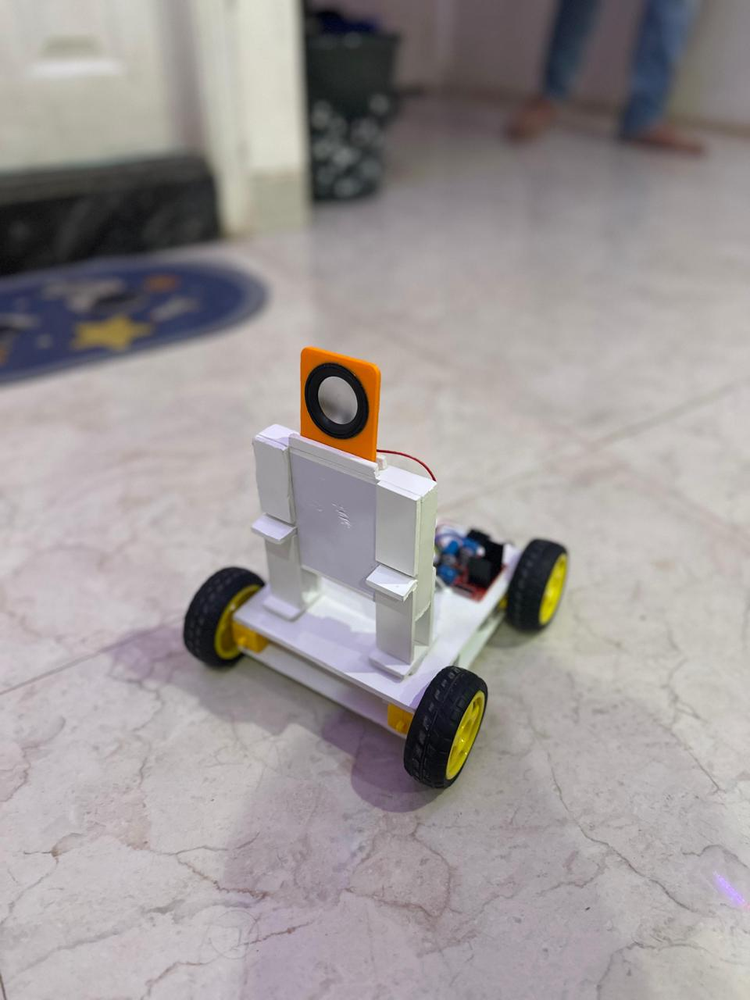

# WiFi-Enabled Talking Robot Car 🤖📡

A compact, interactive robot car controlled over WiFi using voice commands or a mobile interface. Built using the ESP8266 NodeMCU microcontroller, this project integrates basic motor controls with wireless communication and speech recognition (via Google Voice).

---

## 🚀 Features

- WiFi-enabled robot car using ESP8266
- Real-time control via smartphone browser or app
- Voice-controlled movement using Google Speech Recognition
- Adjustable motor speed (0–9 levels)
- Headlight control via command
- Fully offline local hotspot (no internet required)

---

## 📷 Project Media

### Robot View

### Circuit Diagram

---

## 🔧 Setup Instructions

1. **Open Arduino IDE**
2. **Add ESP8266 Board Manager URL**:  
   Go to `File > Preferences`, and add this URL to the "Additional Board Manager URLs":
    http://arduino.esp8266.com/stable/package_esp8266com_index.json
3. **Select Board**:  
- `Tools > Board > NodeMCU 1.0 (ESP-12E Module)`

4. **Upload Code**:  
- Copy and paste the code from this repository into your Arduino IDE.
- Click **Upload**.

5. **Connect to Robot’s WiFi Network**:  
- Look for a network named `Project wifi car`.
- Connect via mobile or browser to the robot's IP (usually `192.168.4.1`).

6. **Control Your Robot**:
- Use the web interface to move the robot.
- Use **Google Voice Commands** like:
  - "Move forward"
  - "Turn left"
  - "Stop"
  - "Turn on light"

---

## 🧠 Code Overview

The code handles:

- **Motor direction & speed control** via GPIO pins
- **WiFi Access Point setup** with ESP8266WebServer
- **Command parsing** for:
- Movement (F, B, L, R, etc.)
- Speed adjustment (0–9)
- Light ON/OFF (W/w)
- Stop command (S)

Commands are received through a web server and mapped to robot actions in real-time.

---

## 🛠 Technologies Used

- ESP8266 (NodeMCU)
- Arduino IDE
- HTML (Web control UI)
- Google Speech Recognition (via phone voice control)

---

## 👥 Team Members

- Mohammed Amaan  
- Spandana H  
- Apoorva Talwar  
- Yashwant Kag  

Guided by: **Dr. Afroz Pasha**  
Presidency University, School of Information Science

---

## 📄 License

This project is licensed under the **MIT License**.  
Feel free to use, modify, and distribute with attribution.

---

## 🙌 Acknowledgements

Special thanks to our faculty guide and Presidency University for the support throughout the development of this project.

---
